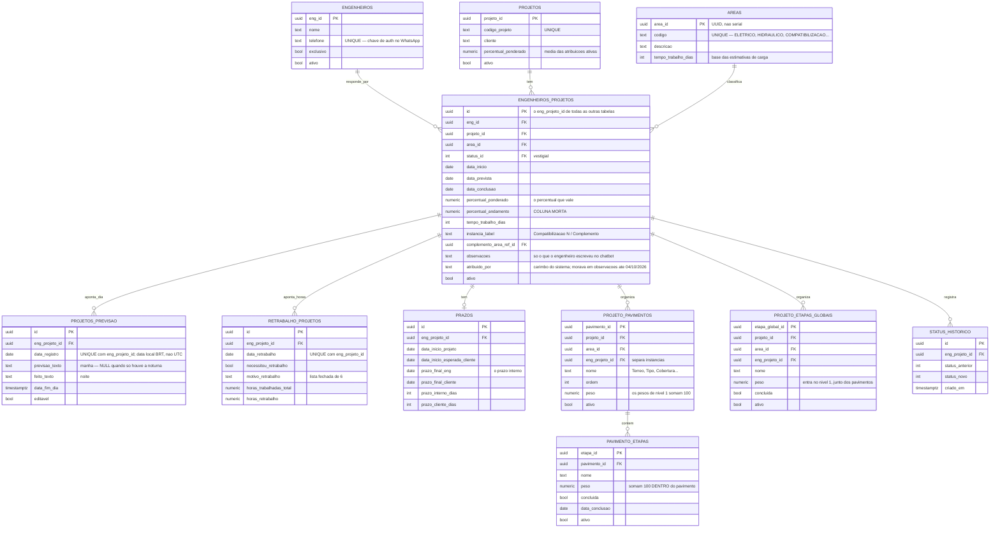

# Modelo de dados

Diagrama e detalhes do schema. O [README](../README.md#modelo-de-dados) resume o essencial; aqui
ficam os nomes de coluna, o diagrama e as sutilezas que não cabiam lá.

A fonte de verdade é o SQL: `supabase/MASTER_SCHEMA_COMPLETO.sql` mais `supabase/migrations/`. Quando
este documento divergir do SQL, o SQL está certo.

## O núcleo

`engenheiros_projetos` é o hub. Uma linha é uma **atribuição**: um engenheiro responsável por uma
disciplina de um projeto, numa instância. Quase tudo pendura nela por `eng_projeto_id`.

## Tabelas periféricas

| Tabela | Para quê |
|---|---|
| `area_pavimentos_template`, `area_etapas_template` | Templates por disciplina. Criar uma atribuição semeia pavimentos e etapas a partir daqui (trigger `trg_seed_pav_etapa`) |
| `status_codes` | Etapas nominais com `ordem` e `percentual_base`. **Vestigial** — ver abaixo |
| `dono_empresa` | Cadastro do dono, autenticado por telefone como os engenheiros |
| `complexidade_tarefas` | 5 níveis (`MUITO_SIMPLES` … `MUITO_COMPLEXA`) com `tempo_estimado_dias` 1/3/7/15/30 |
| `evandro_distribuicao_tasks` | Distribuição de tarefas feita pelo dono. Um trigger cria a atribuição e enfileira a notificação |
| `notificacoes_whatsapp` | Fila das notificações proativas, consumida pelo worker de 1 minuto |
| `user_profiles` | Login do dashboard. PK aponta para `auth.users`; `role` = `owner` \| `engenheiro` |
| `chatbot_logs` | Existe no SQL, **nenhum código TypeScript escreve nela** |

## Três armadilhas de leitura do schema

**`percentual_andamento` está morta.** O valor real é `percentual_ponderado`. Para não quebrar o
front, as views expõem um campo *chamado* `percentual_andamento` que lê `percentual_ponderado` — nome
igual, fonte diferente. Ao depurar um percentual, confirme se está olhando a coluna ou o alias.

**`status_codes` e `status_id` são vestigiais.** Ainda são populados, mas o status exibido não vem
deles: é derivado do percentual. `status_codes.percentual_base` não alimenta nada.

**As quatro datas de `prazos` não têm nomes óbvios.** `prazo_final_eng` é o **prazo interno**, não um
prazo do engenheiro; `prazo_final_cliente` é o prazo acordado com o cliente. E `data_prevista` em
`engenheiros_projetos` é o que alimenta o cálculo de atraso — não as colunas de `prazos`.

## Significado dos status

O status exibido deriva do percentual, mas os códigos continuam em uso em `status_historico` e no
cálculo de dias de paralisação. O que distingue cada um (vocabulário de negócio da TecPred):

| Código | Quando usar |
|---|---|
| `AGUARDANDO_INICIO` | Projeto recebido, esperando documentação, reunião ou liberação |
| `EM_EXECUCAO` | Engenheiro trabalhando ativamente: dimensionamento, traçado, pré-projeto, detalhamento |
| `EM_APROVACAO` | Enviado ao cliente ou responsável, aguardando retorno |
| `PARADO_TECPRED` | Aguarda decisão **interna**, aprovação técnica ou redistribuição |
| `PARADO_CLIENTE` | Aguarda informações, revisões ou decisões **do cliente** |
| `AGUARDANDO_INF_CLIENTE` | Idem `PARADO_CLIENTE` — a definição original dos dois é a mesma |
| `CONCLUIDO` | Finalizado e entregue |

> `PARADO_CLIENTE` e `AGUARDANDO_INF_CLIENTE` foram definidos com a mesma descrição na origem. Os
> dois contam como paralisação no relatório PDF, então a escolha entre eles não muda número — mas
> também não há regra escrita para decidir. Se precisar distinguir, defina a regra antes de usar.

## Múltiplas instâncias

Compatibilização e Complemento podem se repetir no mesmo projeto — várias rodadas, cada uma com seu
`instancia_label`.

O que faz isso funcionar é `eng_projeto_id` em `projeto_pavimentos` e `projeto_etapas_globais`: sem
ele, concluir as etapas de uma rodada de Compatibilização concluiria todas as outras. O
`COALESCE(eng_projeto_id, '00000000-0000-0000-0000-000000000000')` que aparece nos índices e funções
é o tratamento das linhas **legadas**, criadas antes dessa coluna existir.

Um trigger (`validar_instancia_engenheiros_projetos`) normaliza o label de Compatibilização,
auto-numerando "Compatibilização N", exige `complemento_area_ref_id` para Complemento e rejeita label
duplicado no mesmo projeto.

## Numeração de projetos

`gerar_proximo_codigo_projeto()` monta `PRJ-%03d` a partir do maior número já usado. Ele extrai
**todos os dígitos** do código com `regexp_replace(codigo_projeto, '[^0-9]', '', 'g')` e toma o
`MAX`.

Consequência: um projeto cadastrado como `PRJ-2025-001` é lido como o número **2025001** e congela a
numeração de todos os projetos futuros nesse patamar. Se a numeração automática parecer quebrada num
banco, procure um código com ano embutido.

## Views

As views do dashboard vivem em `supabase/migrations/` — e em alguns arquivos soltos de `supabase/`.
Várias foram **redefinidas múltiplas vezes** em migrations diferentes; só a mais recente vale:

| View | Definição vigente |
|---|---|
| `vw_projetos_completo` (chatbot) | `20260728_retrabalho_por_horas.sql` |
| `vw_projetos_detalhado` (dashboard) | `20260703_dashboard_atribuicoes_transferir_excluir.sql` |
| `vw_retrabalho_*` | `20260728_retrabalho_por_horas.sql` |
| `vw_bloco1_visao_geral`, `vw_bloco3_carga_trabalho` | `20260606_conclusao_por_area.sql` |
| `vw_dashboard_producao_apontamentos` | `20260901_fix_dashboard_producao_apontamentos_assignment_join.sql` |
| `vw_relatorio_projeto_pdf` | `20260717_status_historico_paralisacao.sql` |
| `vw_bloco2_atrasos_engenheiro`, `vw_bloco2_atrasos_area` | **`supabase/CRIAR_VIEWS.sql`** — fora de `migrations/` |

Duas views consultadas por código são definidas fora de `migrations/` (última linha da tabela), e uma
— `view_dashboard_ceo`, usada por `integrations/sheets/ceo_sync.ts` — **não é criada por nenhum SQL do
repositório**. Esse caminho está morto.

Resíduos conhecidos: `vw_retrabalho_taxa_area_projeto` ainda expõe `dias_com_registro` fixo em `0` e
`taxa_retrabalho_por_dia` como alias do percentual, colunas mantidas só para não quebrar o front.
`vw_bloco4_execucao_media` e `vw_progresso_ponderado` não são consultadas por código nenhum.
